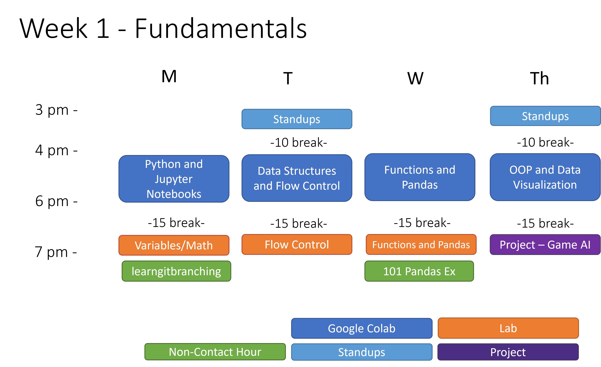
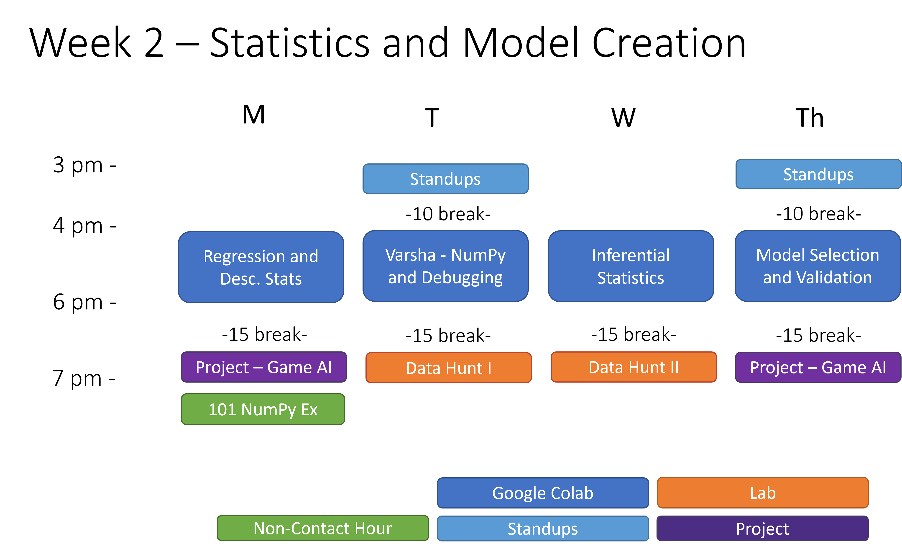
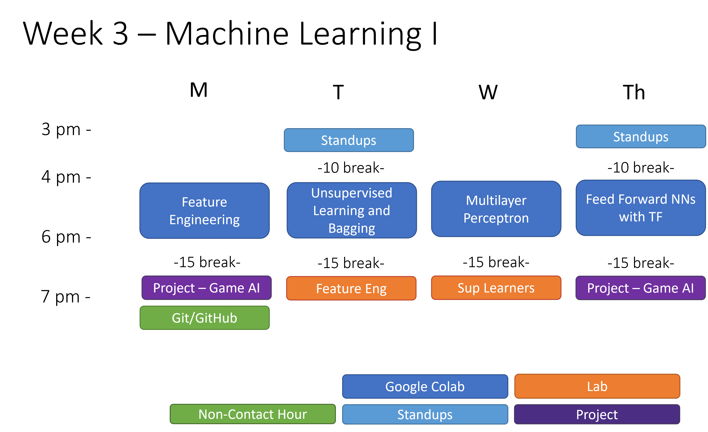
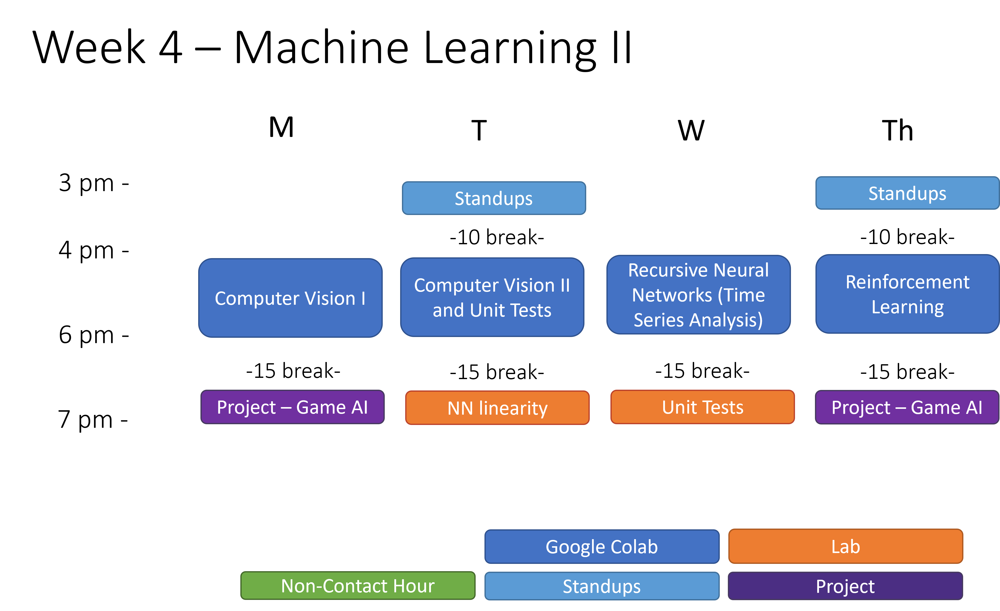

# technology_fundamentals

Companion Reading: [The Python Data Science Handbook](https://jakevdp.github.io/PythonDataScienceHandbook/)

## Series Overview

### Course 1: Fundamentals

*	Data Science Topics
	   * introduction to python; lists, dictionaries, and flow control; functions and pandas; visualization: matplotlib, seaborn and pandas; 
*	Software Development Topics 
	   * object oriented programming
*	Project
	   * Tech Fun C1 P1: Building TicTacToe in Python
*	Sessions
	   * Tech Fun C1 S1: Introduction to Python and Jupyter Notebooks
	   * Tech Fun C1 S2: Data Structures and Flow Control
	   * Tech Fun C1 S3: Functions and Pandas
	   * Tech Fun C1 S4: Visualization and OOP
* Labs
     * Tech Fun C1 L1: Practice with Python and Jupyter Notebooks
     * Tech Fun C1 L2: Practice with Flow Control
     * Tech Fun C1 L3: Practice with Functions and Pandas

</img>

 
 

### Course 2: Statistics and Model Creation

*	Data Science Topics 
	   *	bias-variance tradeoff; regression: linear, logistic, and multivariate; regularization: L1 and L2; inferential statistics: moods median, t-tests, f-tests, ANOVA; descriptive statistics: mean, median, mode, kurtosis, skew
*	Software Development Topics
	   *	debugging
*	Project
	   *	Tech Fun C2 P2 PART I: Game AI, OOP and Agents (OOP)
	   *	Tech Fun C2 P2 PART II: Game AI, OOP and Agents (Random Agent)
	   *	Tech Fun C2 P2 PART III: Game AI, OOP and Agents (Debugging)
*	Sessions
	   *	Tech Fun C2 S1: NumPy
	   *	Tech Fun C2 S2: Regression and Descriptive Statistics
	   *	Tech Fun C2 S3: Inferential Statistics
	   *	Tech Fun C2 S4: Model Selection and Validation
 * Labs
     * Tech Fun C2 L1: Descriptive Statistics Data Hunt
     * Tech Fun C2 L2: Inferential Statistics Data Hunt

</img>

 
 

### Course 3: Machine Learning I

*	Data Science Topics 
	   *	Supervised learning: classification; resampling methods; model selection and regularization; beyond regression coefficients: tree-based methods; unsupervised learning: clustering and dimensionality reduction; neural networks: the perceptron, feed forward neural networks
*	Software Development Topics
	   *	unit tests
*	Project
	   *	Tech Fun C3 P3: Game AI, Statistical Analysis
	   *	Tech Fun C3 P4: Game AI, Heuristical Agents
*	Sessions
	   *	Tech Fun C3 S1: Feature Engineering
	   *	Tech Fun C3 S2: Unsupervised and Supervised Learning
	   *	Tech Fun C3 S3: Multilayer Perceptron
	   *	Tech Fun C3 S4: Feed Forward Neural Networks with Tensor Flow
 * Labs
     * Tech Fun C3 L1: Feature Engineering
     * Tech Fun C3 L2: Supervised Learners
     

</img>

 

### Course 4: Machine Learning II

*	Data Science Topics 
	   *	computer vision: CNNs, importing and manipulating images; time series analysis: LSTMs, autocorrelation; reinforcement learning: defining environments in OpenAI Gym
*	Software Development Topics
     * servers (flask and fastAPI)
*	Project
	   *	Tech Fun C4 P5 Game AI, 1-step Look Ahead
	   *	Tech Fun C4 P6 Game AI, N-step Look Ahead
	   *	Tech Fun C4 P7 Game AI, Reinforcement Learning
*	Sessions
	   *	Tech Fun C4 S1: Computer Vision I
	   *	Tech Fun C4 S2: Computer Vision II
	   *	Tech Fun C4 S3: Time Series Analysis
	   *	Tech Fun C4 S4: Reinforcement Learning
 * Labs
     * Tech Fun C4 L1: Neural Network linearity
     * Tech Fun C4 L2: Unit Tests

</img>

 
 
